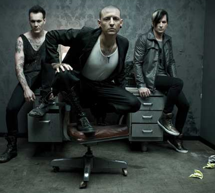

<!DOCTYPE html>
<html>
<head>
<title>Linkin Park</title>
</head>

    

<h1 style="color:white;font-size:300%;">Chester Bennington</h1>
<h2 style="color:white;"> Front-man dei Linkin Park </h2>

Chester Charles Bennington, nato a Phoenix il 20 marzo 1976 – muore a Los Angeles il 20 luglio 2017, era un cantautore e musicista statunitense,
 
conosciuto principalmente per essere stato il frontman del gruppo musicale <a href="https://www.youtube.com/channel/UCZU9T1ceaOgwfLRq7OKFU4Q" target="_blank">Linkin Park</a>. tra il 2013 e il 2015,
  anche degli <u>Stone Temple Pilots</u>, oltre che del progetto parallelo <u>Dead by Sunrise</u>.

<ul style="color:white;">
 

  <h3 style="color:white;"> <li> <i> Storia </i> </li> </h3> 
 
<body>

Di origini inglesi, olandesi e gallesi, Bennington era figlio di un poliziotto e di un'infermiera e trascorse i suoi primi vent'anni in Arizona. I suoi genitori divorziarono nel 1987, lasciandolo insieme ad un fratello e due sorelle. Dopo aver scelto di stare con il padre, fu incoraggiato dal fratello maggiore ad ascoltare gruppi come Foreigner, Loverboy e Rush, che citò tutti come propri ispiratori. A due anni imparò dal fratello a cantare un brano, Hot Blooded dei Foreigner.
 
 
Costretto dalla sua situazione familiare a spostarsi in varie città dell'Arizona, Bennington iniziò a fumare <u>marijuana</u> all'età di 11 anni. Non ebbe un'infanzia facile: dai 7 ai 13 anni fu <u>molestato sessualmente</u> da un ragazzo adolescente, che poi non denunciò perché scoprì essere a sua volta una vittima, soffrì di <u>dipendenza da droghe pesanti</u> come LSD, oppio, metanfetamina ed eroina. Dovette inoltre saltare da un liceo all'altro, finché nel 1995 si diplomò alla Washington High School.
 
 
Il 12 maggio 1996 diventò padre di Jaime, avuto da una relazione giovanile con Elka Brand. Lo stesso anno Bennington conobbe Samantha Marie Olit mentre lavorava ad un fast food Burger King ed il 31 ottobre successivo la sposò. Dalla loro unione è nato Draven Sebastian il 19 aprile 2002. I due hanno divorziato il 2 maggio 2005 e Bennington si è risposato il 31 dicembre successivo con la modella di Playboy Talinda Bentley. Il 16 marzo 2006 è nato il primo figlio della coppia, Tyler Lee; nello stesso anno Bennington ha adottato Isaiah (fratello di Jaime, avuto da Brand e da un altro uomo). L'11 novembre 2011 Talinda dà alla luce le gemelle Lily e Lila.

<h3 style="color:white;"> <li> <i> Carriera prima dei Linkin Park </i> </li> </h3>

Nel 1993, ispirato dai suoi gruppi preferiti <u>Depeche Mode e Stone Temple Pilots</u> e spinto dal suo sogno di diventare un cantante, Bennington (che aveva già cominciato a suonare il pianoforte nella prima adolescenza) avviò una propria carriera musicale come cantante dei <u>Sean Dowdell and His Friends?</u>, incidendo l'omonimo demo in quell'anno. Lasciato il gruppo, entrò nei <u>Grey Daze</u>, con i quali ottenne discreta popolarità solo in Arizona e pubblicò gli album <u>Wake Me</u> (1994) e <u>...No Sun Today</u> (1996). Nel 1998 Bennington abbandonò il gruppo. 

<h3 style="color:white;"> <li> <i> Linkin Park </i> </li> </h3>

Nel 1998, a causa dell'abbandono di Mark Wakefield, gli <u>Xero</u> avviarono insieme a Jeff Blue la ricerca di un cantante. Blue contattò proprio Bennington, che dopo tre giorni dalla chiamata, eseguì un provino al telefono. Bennington venne successivamente convinto a trasferirsi a <u>Los Angeles</u>, dove sarebbe stato definitivamente scelto dagli <u>Xero</u> dopo alcuni provini. Nel 1999 gli <u>Xero</u> cambiarono nome in <u>Hybrid Theory</u> e pubblicarono l<u>'EP omonimo</u> nello stesso anno. Fu grazie a questo disco e ad alcuni concerti che riuscirono a firmare un contratto con la <u>Warner Bros. Records</u> verso la fine dell'anno.
 
Dopo aver cambiato nome in <u>Linkin Park</u>, il 24 ottobre 2000 pubblicarono l'album d'esordio <u>Hybrid Theory</u>, che contò soprattutto sui singoli <a href="https://www.youtube.com/watch?v=4qlCC1GOwFw" target="_blank">One Step Closer</a> ,<a href="https://www.youtube.com/watch?v=Gd9OhYroLN0" target="_blank">Crawling</a> e <a href="https://www.youtube.com/watch?v=eVTXPUF4Oz4" target="_blank">In The End</a>. Hybrid Theory divenne il disco di maggior successo del genere nu metal, con più di 27 milioni di copie vendute in tutto il mondo. Con il gruppo pubblicò ulteriori sei album in studio, il cui ultimo, <a href="https://www.google.com/search?hl=it&q=linkin+park+one+more+light+brani&stick=H4sIAAAAAAAAAONgFuLVT9c3NEw2K0qvNMwzU0LlaolmJ1vp55YWZybrJ-YkleZaFefnpRcvYlXIyczLzsxTKEgsylbIz0tVyM0vSgUKpmeUKCQVJeZl7mBlBABGlONpXQAAAA&sa=X&ved=2ahUKEwjkmabHgLHpAhUQZMAKHUdxD_MQMTAdegQIEhAK&biw=1366&bih=614" target="_blank">One More Light</a>, uscì nel maggio 2017.

<h3 style="color:white;"> <li> <i> Progetti secondari: Dead by Sunrise e Stone Temple Pilots </i> </li> </h3>

Nel 2005 Bennington formò un progetto solista insieme a Ryan Shuck e Amir Derakh degli Orgy e dei Julien-K, chiamandolo inizialmente Snow White Tan (in riferimento a una parte del brano di David Bowie Ziggy Stardust) e successivamente cambiato in <u>Dead by Sunrise</u>. Il loro album d'esordio, intitolato <u>Out of Ashes</u>, era originariamente previsto per il 2007 ma a causa degli impegni di Bennington con i Linkin Park per la pubblicazione del terzo album in studio <u>Minutes to Midnight</u> e del relativo tour promozionale, la sua pubblicazione avvenne soltanto il 13 ottobre 2009.
 
Il 18 maggio 2013 Bennington si esibì con gli Stone Temple Pilots al KROQ Weenie Roast, portando al debutto l'inedito Out of Time. In una video-intervista successiva al concerto, Bennington dichiarò di essere il nuovo cantante del gruppo, senza abbandonare comunque i Linkin Park, da lui ritenuto il suo gruppo principale. Il 15 luglio gli Stone Temple Pilots annunciarono un tour nordamericano, svoltosi a partire dal mese di settembre, e l'EP High Rise, pubblicato l'8 ottobre 2013.
Bennington lasciò tuttavia in maniera amichevole il gruppo il 9 novembre 2015 a causa della sua impossibilità a sottostare contemporaneamente agli impegni sia con gli Stone Temple Pilots sia con i Linkin Park.

<h3 style="color:white;"> <li> <i> Membri dei Linkin Park </i> </li> </h3>

<li> Chester Bennigton </li>
<li> Mike Shinoda </li>
<li> Joe Hahn </li>
<li> Phoenix </li>
<li> Rob Bourdon </li>
<li>Brad Delson</li>

<h3> <li> <i> Album dei Linkin Park </i> </li> </h3>

<ol>
  <li>Hybrid Theory (2000)</li>
  <li>Meteora (2003)</li>
  <li>Minutes to Midnight (2007)</li>
  <li>A Thousand Suns (2010)</li>
  <li>Living Things (2012)</li>
  <li>The Hunting Party (2014)</li>
  <li>One more light (2017)</li>
  
</ol>

<h3> <li> <i> Album e canzoni dei Linkin Park </i> </li> </h3>
  
  <table style="width:100%">
  <tr style="color:white;font-size:125%;">
  <i>
    <th><i>Hybrid Theory</i></th>
    <th><i>Meteora</i></th> 
    <th><i>Minutes to Midnight</i></th>
    <th><i>A Thousand Suns</i></th>
    <th><i>Living Things</i></th>
    <th><i>The Hunting Party</i></th>
    <th><i>One more light</i></th>
  </i>
  </tr>
  
  <tr>
    <td>Papercut</td>
    <td>Foreword</td>
    <td>Wake</td>
    <td>The Requiem</td>
    <td>Lost in the Echo</td>
    <td>Drawbar</td>
    <td>Nobody Can Save Me</td>
  </tr>
  
  <tr>
   
    <td>One Step Closer</td>
    <td>Don't Stay</td>
    <td>Given Up</td>
    <td>Burning in the Skies</td>
    <td>In My Remains</td>
    <td>Keys to the Kingdom</td>
    <td>Good Goodbye</td>
  </tr>
  
  <tr>
    <td>With You</td>
    <td>Somewhere I Belong</td>
    <td>Leave Out All the Rest</td>
    <td>When They Come for Me</td>
    <td>Burn It Down</td>
    <td>All for Nothing</td>
    <td>Talking to Myself</td>
  </tr>
  
  <tr>
    <td>Points of Authority</td>
    <td>Lying from yoy</td>
    <td>Bleed It Out</td>
    <td>Robot Boy</td>
    <td>Lies Greed Misery</td>
    <td>Guilty All the Same</td>
    <td>Battle Symphony</td>
  </tr>
  
  <tr>
    <td>Crawling</td>
    <td>Hit the Floor</td>
    <td>Shadow of the Day</td>
    <td>Waiting for the End</td>
    <td>I'll Be Gone</td>
    <td>The Summoning</td>
    <td>Invisible</td>
  </tr>
  
  <tr>
    <td>Runaway</td>
    <td>Faint</td>
    <td>What I've Done</td>
    <td>Blackout</td>
    <td>Castle of Glass</td>
    <td>War</td>
    <td>Heavy</td>
  </tr>
  
  <tr>
    <td>By Myself</td>
    <td>Figure.09</td>
    <td>Hands Held High</td>
    <td>Wretches and Kings</td>
    <td>Victimized</td>
    <td>Wastelands</td>
    <td>Sorry for Now</td>
  </tr>
  
  <tr>
    <td>In The End</td>
    <td>Breaking the Habit</td>
    <td>No More Sorrow</td>
    <td>Iridescent</td>
    <td>Roads Untraveled</td>
    <td>Until It's Gone</td>
    <td>Halfway Right</td>
  </tr>
  
  <tr>
    <td>A Place for My Head</td>
    <td>From the Inside</td>
    <td>Valentine's Day</td>
    <td>Blackout</td>
    <td>Skin to Bone</td>
    <td>Rebellion</td>
    <td>One More Light</td>
  </tr>
  
  <tr>
    <td>Forgotten</td>
    <td>Nobody's Listening</td>
    <td>In Between</td>
    <td>Fallout</td>
    <td>Until It Breaks</td>
    <td>Mark the Graves</td>
    <td rowspan="3">Sharp Edges</td>
  </tr>
  
  <tr>
    <td>Pushing Me Away</td>
    <td>Session</td>
    <td>In Pieces</td>
    <td>The Catalyst</td>
    <td>Tinfoil</td>
    <td>Final Masquerade</td>
  </tr>
  
  <tr>
    <td>My December</td>
    <td>Numb</td>
    <td>The Little Things Give You Away</td>
    <td>The Messenger</td>
    <td>Powerless</td>
    <td>A Line in the Sand</td>
  </tr>
</table>
  
<h3 style="color:white;"> <li> <i> Morte </i> </li> </h3>
  

Il 20 luglio 2017 Bennington è stato trovato senza vita nella sua residenza a Palos Verdes Estates in California. Secondo quanto riportato dal medico legale, il cantante si è suicidato tramite impiccagione.
 
Il funerale di Bennington si è svolto il 29 luglio al South Coast Botanic Garden di Palos Verdes Estates, a cui hanno presenziato oltre ai familiari e i componenti dei Linkin Park, anche musicisti che hanno suonato con il gruppo nel corso degli anni.
 
Il 5 dicembre 2017, la rivista Billboard ha scritto che il rapporto tossicologico di Bennington mostrava «una traccia» di alcol nel sistema del cantante al momento della morte.

 

  

</ol> 
</body>
</html>
